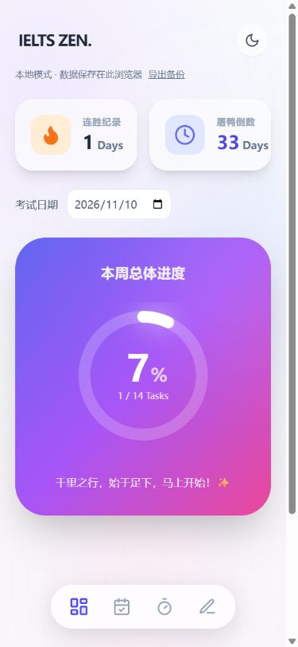
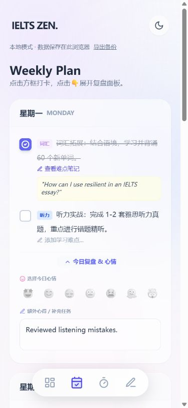

<a id="readme-top"></a>

<div align="center">

# IELTS Zen · 雅思禅

**规划一周，专注今天，持续进步。**

集周计划、学习笔记、专注时钟与手绘板于一体的雅思备考工具。

[English](README.md) · **简体中文**

[](https://github.com/xuzihao723/ielts-zen-app/actions/workflows/check.yml)
[](https://react.dev/)
[](LICENSE)

[在线体验](https://xuzihao723.github.io/ielts-zen-app/) · [报告问题](https://github.com/xuzihao723/ielts-zen-app/issues/new) · [提出建议](https://github.com/xuzihao723/ielts-zen-app/issues/new)

</div>

> 在线站点展示已部署的 `main` 版本，PR 中的改动需要合并并部署后才会展示。应用界面以中文为主，README 提供中英文切换。

<details>
<summary>目录</summary>

- [项目介绍](#项目介绍)
- [主要功能](#主要功能)
- [快速开始](#快速开始)
- [可选配置](#可选配置)
- [使用方法](#使用方法)
- [部署](#部署)
- [项目结构](#项目结构)
- [开发检查](#开发检查)
- [限制与路线图](#限制与路线图)
- [参与贡献](#参与贡献)
- [许可证与联系](#许可证与联系)

</details>

## 项目介绍

雅思禅将学习任务、笔记和专注工具整合进适合手机使用的工作空间。七天计划覆盖词汇、听力、阅读、写作、口语与复盘。不需要账号或密钥即可开始使用，学习数据保存在当前浏览器；Firebase 存储与 AI 导师均为可选功能。

本项目是学习管理工具，不是雅思官方服务，也不提供自动评分或分数保证。



<details>
<summary>查看周计划</summary>



</details>

## 主要功能

| 工具 | 功能说明 |
| --- | --- |
| 仪表盘 | 展示本周完成比例、已记录的连续打卡天数和自定义考试倒计时。 |
| 周计划 | 任务在待办 → 完成 → 跳过 → 待办之间循环切换。 |
| 笔记与复盘 | 保存学习难点、每日心情和补充任务或心得。 |
| 专注时钟 | 提供 25 分钟专注和 5 分钟休息，支持开始、暂停、重置；根据截止时间校正后台标签页的计时延迟。 |
| 环境音 | 外部音源可访问时，可选择雨声、咖啡馆或白噪音。 |
| 手绘板 | 支持鼠标、触控书写、清空与 PNG 导出；同一次页面会话内切换导航或主题可保留画作。 |
| 本地保存 | 刷新后保留进度、主题和考试日期；可导出当前数据与本地周归档的 JSON 备份。 |
| 可选 Firebase | 按浏览器匿名用户 ID 保存数据，并以原子写入方式归档旧周。 |
| 可选 AI 导师 | 通过自己的服务端请求词汇例句、写作思路或备考建议，回答以中文呈现。 |

## 快速开始

### 环境要求

- Git 与支持 JavaScript 模块、Import Maps 的现代浏览器。
- 静态运行使用 Python 3；可选本地服务和开发检查使用 Node.js 22 或更新版本。
- 需要联网加载库 CDN。本地模式无需云端凭据，但并非完整离线应用。

### 静态运行

```sh
git clone https://github.com/xuzihao723/ielts-zen-app.git
cd ielts-zen-app
python -m http.server 8080 --bind 127.0.0.1
```

访问 [http://127.0.0.1:8080](http://127.0.0.1:8080)。学习工具无需安装 npm 依赖，也无需 Firebase 或 API 密钥。请通过 HTTP 服务访问，不要直接用 `file://` 打开 HTML。

### 可选 Node 服务

```sh
npm start
```

同样访问上述地址。服务仅使用 Node 内置模块，npm 依赖用于开发检查。

## 可选配置

公开配置位于 [config.js](config.js)：

```js
window.IELTS_ZEN_CONFIG = {
  firebase: null,
  aiEndpoint: '',
};
```

保留默认值即可使用本地模式。修改配置后刷新页面。不要将 Gemini 密钥放进浏览器文件。

### Firebase 存储

1. 在 [Firebase 控制台](https://console.firebase.google.com/)创建自己的项目，注册网页应用，复制网页配置。
2. 启用[匿名登录](https://firebase.google.com/docs/auth/web/anonymous-auth)，创建 Firestore 数据库。
3. 在 Firestore Rules 页面发布 [firestore.rules](firestore.rules)。规则必须要求 `request.auth.uid == userId`；仅要求“已经登录”不足以隔离不同用户的数据。
4. 将 `firebase: null` 替换为自己的网页配置；如配置需要，在 Authentication 中添加部署域名为授权域名。

```js
firebase: {
  apiKey: 'YOUR_FIREBASE_WEB_API_KEY',
  authDomain: 'YOUR_PROJECT.firebaseapp.com',
  projectId: 'YOUR_PROJECT',
  appId: 'YOUR_FIREBASE_APP_ID',
},
```

Firebase 网页配置用于标识公开客户端项目，数据库访问由认证和规则保护，详见 [Firebase API 密钥说明](https://firebase.google.com/docs/projects/api-keys)。

**匿名登录不等于跨设备账号。** 不同浏览器或设备会取得不同用户 ID；清除站点数据可能失去匿名账户访问权，请先导出备份。永久账号绑定仍在规划中。

数据先保存到本地。连接云端时，按 `updatedAt` 选择较新的整份文档，不支持逐字段协作合并。云端写入失败会保留本地数据，可刷新重试同步。周归档在应用检测到本地新的一周时执行，并非后台定时任务。

### 本地 AI 导师

1. 复制 [.env.example](.env.example) 为 `.env`，填写自己的 `GEMINI_API_KEY`。该文件被 Git 忽略，仅由 Node 服务读取。
2. 使用 `GEMINI_MODEL` 指定自己账号可用的模型，默认值为 `gemini-2.5-flash`；修改前查看[模型可用性](https://ai.google.dev/gemini-api/docs/models)。
3. 在 `config.js` 设置 `aiEndpoint: '/api/advice'`，执行 `npm start`。

浏览器发送 `{ "note": "…", "taskType": "词汇" }`，接收 `{ "text": "…" }`。失败时接口返回非 2xx 状态与 `{ "error": "…" }`。只有点击 AI 按钮后，笔记才会发送到配置的后端和 Google。代理限制笔记长度、每分钟五次有效请求和三十秒超时，不向浏览器返回密钥。

附带服务绑定 `127.0.0.1`，适合个人本机使用。公开 AI 服务需要独立的 HTTPS 认证后端、配额、滥用防护与合适的 CORS。GitHub Pages 无法运行 Node 或保存服务端秘密；拆分密钥字符串或注入前端构建不能保护密钥，详见 [Google 密钥安全指南](https://ai.google.dev/gemini-api/docs/api-key)。

## 使用方法

1. 在仪表盘设置考试日期。未设置时显示 `—`，过去的日期显示剩余零天。
2. 点击周计划任务方框切换状态；只有完成任务计入进度。
3. 记录难点并保存，配置 AI 后可先请求学习建议。
4. 展开每日复盘，选择心情、填写心得。输入时保存在本地，离开输入框时同步云端。
5. 选择专注或休息模式后开始计时；到零停止，切换模式会重置，不会自动开始休息。
6. 关闭页面前将画作导出为 PNG；点击状态栏的“导出备份”保存 JSON 学习备份。

## 部署

静态部署需同时发布 `index.html`、`config.js` 与 `zen-core.js`。

[GitHub Pages](https://docs.github.com/en/pages/getting-started-with-github-pages/configuring-a-publishing-source-for-your-github-pages-site) 可在推送审阅后的改动后设置 **Settings → Pages → Deploy from a branch → main → /(root)**。默认配置使用本地模式。Firebase 需要自己的项目和规则；AI 需要另行部署后端，不能只在 Pages 上填写 `/api/advice`。

当前 JSX 编译与 Tailwind 样式通过 CDN 在浏览器中完成，生产构建仍在路线图中。

## 项目结构

| 文件 | 职责 |
| --- | --- |
| [index.html](index.html) | React 18 界面、Tailwind、Import Map 与可选 Firebase 集成。 |
| [zen-core.js](zen-core.js) | 本地日期、周归档、连续打卡与计时计算。 |
| [config.js](config.js) | 公开云端与 AI 接口配置。 |
| [server.mjs](server.mjs) | 可选本地静态服务和服务端 Gemini 代理。 |
| [firestore.rules](firestore.rules) | 按用户隔离数据库访问。 |
| [tests/core.test.mjs](tests/core.test.mjs) / [tests/server.test.mjs](tests/server.test.mjs) | 日期、归档、计时与代理回归测试。 |

云端路径：`users/{uid}/learningData/progress`、`users/{uid}/archives/{weekId}`。本地键：`ielts-zen-progress-v1`、`ielts-zen-archives`、`ielts-zen-dark`、`ielts-zen-exam`。

## 开发检查

```sh
npm ci
npm run check
npm test
```

检查会编译内嵌 JSX、验证 README 本地链接并拒绝旧的前端密钥配置。测试覆盖日期边界、归档、连续打卡、倒计时、后台计时、静态文件限制、代理校验、供应商错误与限流；CI 分别使用上海和纽约时区。

修改界面后，也请验证连续输入不丢焦点、刷新保存、任务状态循环、计时暂停与重置、画布保留、主题和手机布局。真实 Firebase、Gemini 调用需要自行配置服务；测试使用模拟供应商，不验证外部凭据。

## 限制与路线图

- 浏览器数据与站点来源绑定。已提供备份导出，尚未提供备份导入和归档浏览界面。
- 画作仅在当前页面会话中保留，不同步云端。连续打卡记录在完成任务时更新，不是历史活动日历。
- 外部 CDN、音源可用性和浏览器存储权限会影响功能。
- [ ] 绑定永久账号，支持跨设备访问。
- [ ] 增加归档浏览和备份导入。
- [ ] 增加英文应用界面与可编辑学习计划。
- [ ] 增加生产构建和更完整的自动化界面测试。

## 参与贡献

在 [Issues](https://github.com/xuzihao723/ielts-zen-app/issues) 提交可复现的问题或明确建议。修改代码时请 Fork、创建功能分支、运行检查并提交 PR；涉及界面时附截图。同步更新两种语言的 README，不提交凭据或个人笔记。

漏洞报告请参阅 [SECURITY.md](SECURITY.md)。

## 许可证与联系

项目采用 [MIT 许可证](LICENSE)，由 [xuzihao723](https://github.com/xuzihao723) 维护。

[返回顶部 ↑](#readme-top)
